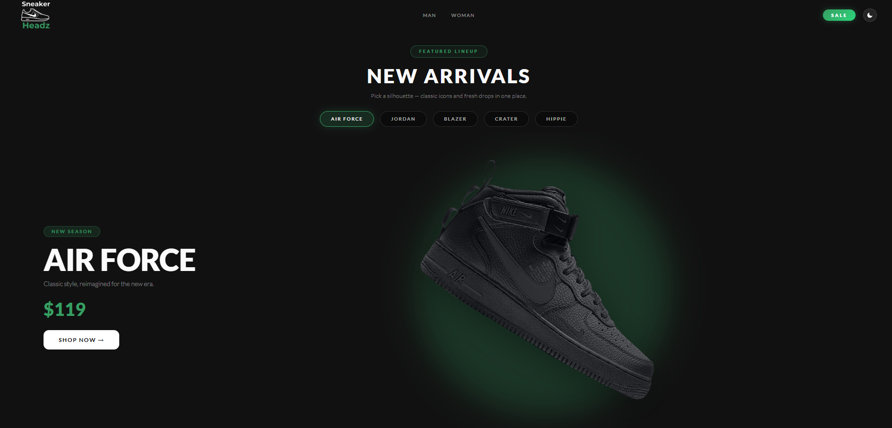
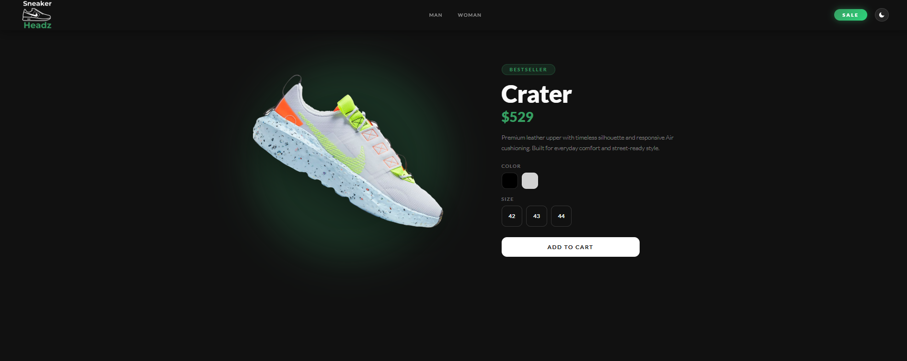
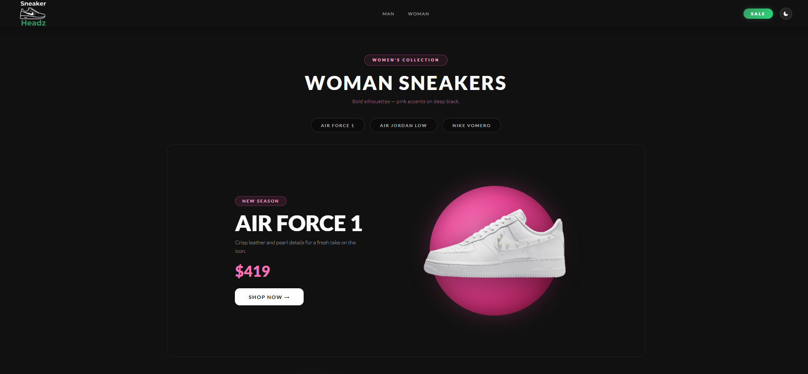
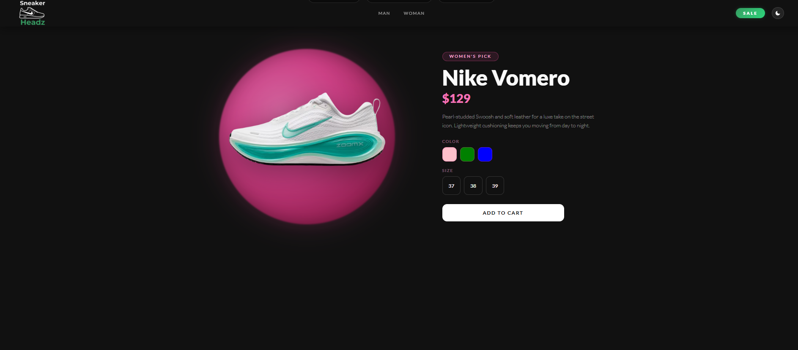
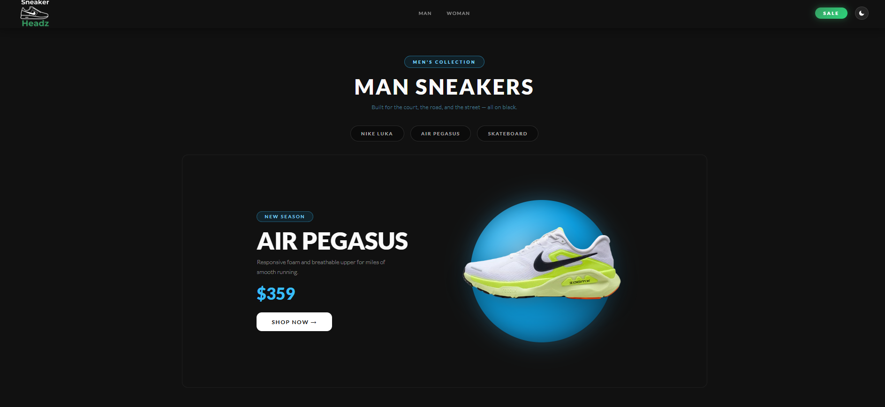
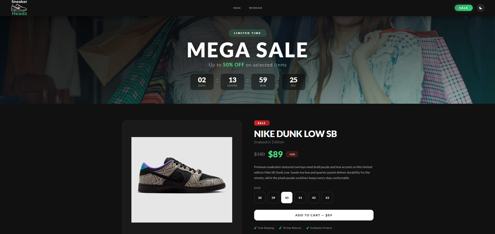
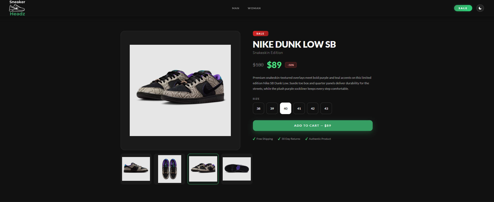
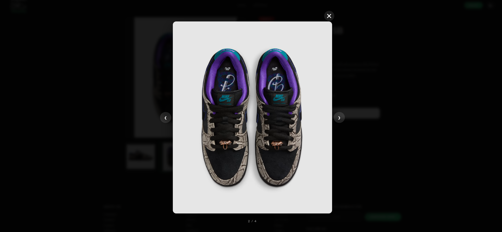

# 👟 Vanilla JS E‑Commerce

A front‑end sneaker storefront built with plain **HTML**, **CSS**, and **JavaScript**—no framework or build step. It showcases a hero carousel, gendered category sections, product detail with color and size pickers, a themed sale area, and lightweight checkout UI modals.

## 🌐 Live demo

**GitHub Pages:** [https://ggarenov.github.io/vanilla-js-ecommerce/](https://ggarenov.github.io/vanilla-js-ecommerce/)

---

## ✨ Features

- 🌓 **Dark / light theme** — toggled in the nav; preference is saved in `localStorage`.
- 📱 **Responsive navigation** — sticky bar on scroll, mobile hamburger, quick jump to men’s / women’s sections and sale.
- 🎠 **Hero slider** — featured models (Air Force, Jordan, Blazer, Crater, Hippie) synced with the main product block.
- 👟 **Product experiences** — separate flows for **main**, **women’s**, and **men’s** lines: sliders, images, prices, **color swatches** (image variants), and **size** selection.
- 💳 **Checkout UI** — “buy” opens a **payment-style modal** (presentation only; no real payments or backend).
- 🏷️ **Sale section** — thumbnail gallery, main image swap, **countdown timer** (end time persisted in `localStorage`), and an **image lightbox** with keyboard support (Escape, arrows).

## 🛠️ Tech stack

| Area   | Details                                              |
|--------|------------------------------------------------------|
| Markup | Semantic HTML (`index.html`)                         |
| Styles | `base.css` (foundation), `style.css` (layout & theme) |
| Logic  | Single `app.js` module — DOM, sliders, modals, timer |

## 📁 Project structure

```
vanilla-js-ecommerce/
├── index.html      # Page structure & content
├── base.css        # Base variables and resets
├── style.css       # Components, layout, themes
├── app.js          # All interactivity
├── img/            # Assets (logo, products, sale images)
│   └── screenshots/   # README preview images
└── README.md
```

> **Note:** The app expects an `img/` folder with paths such as `img/products/`, `img/woman/`, `img/man/`, `img/sale/`, and `img/logo.png`. Add or replace assets there if your clone does not include them.

## 🖼️ Screenshots

Preview of the storefront (images live in `img/screenshots/`).

| | |
| :---: | :---: |
|  |  |
|  |  |
|  |  |
|  |  |

To add or replace shots later, drop new PNG/JPG/WebP files into `img/screenshots/`, update the Markdown paths above (same pattern: ``), then commit and push.

## 🚀 Getting started

This is a static site. You can open `index.html` directly in a browser.

For development, a small local server avoids occasional restrictions with `file://` URLs and matches how the site runs when deployed:

```bash
# Example: Python 3
python -m http.server 8080
```

Then visit `http://localhost:8080` (or use any static server you prefer: VS Code Live Server, `npx serve`, etc.).

No `npm install` or compile step is required.

## 🎨 Customizing products

Product data and image paths live in **`app.js`** in the `products`, `womanProducts`, and `manProducts` arrays. Sale gallery URLs are in `saleGalleryImages` near the sale section logic. Adjust titles, prices, colors, and `./img/...` paths to match your assets.

## 🌍 Browser support

Targets modern evergreen browsers (recent Chrome, Firefox, Safari, Edge) with support for CSS custom properties, `localStorage`, and ES5+ DOM APIs used in the script.

## 📄 License

This app is **open source**: everyone is free to use it, study it, change it, and share it however they like.
